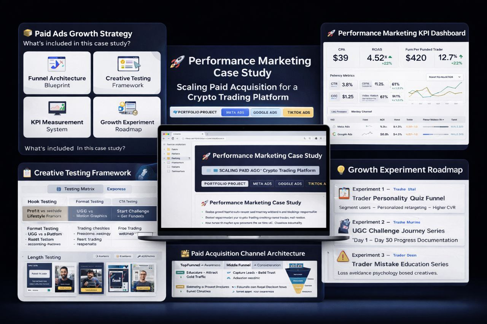

# 🚀 Performance Marketing Case Study  
## Scaling Paid Acquisition for a Crypto Trading Platform

---

## 🧠 Executive Summary

This project simulates a real-world scenario where I operate as a Performance Ads Manager responsible for scaling paid acquisition for a crypto trading platform operating in multiple global markets.

The strategy focuses on:
- Lowering acquisition costs
- Increasing qualified trader signups
- Building a scalable creative testing system
- Expanding into emerging high-growth markets

This case study demonstrates my ability to think beyond running ads — into full funnel revenue growth strategy.

---

## 🎯 Business Objectives

| KPI | Target |
|---|---|
Reduce CPA | -25% |
Increase Qualified Signups | +40% |
Improve Funnel Conversion Rate | +20% |
Scale Multi-Geo Acquisition | Tier 1 + Emerging Markets |

---

## 🧩 Business Challenges Identified

- High competition in crypto paid ads auctions  
- Low trust from cold audiences  
- High creative fatigue in paid social  
- Poor education around prop trading models  
- Scaling difficulty across different economic regions  

---

## 👤 Target Customer Strategy

### Core Audience
- Beginner → Intermediate Traders
- Age: 20 – 40
- Motivations:
  - Financial independence
  - Trading skill development
  - Alternative income streams

---

## 🌍 Market Expansion Plan

### Tier 1 — Revenue Stability
- USA
- UK
- Canada

### Tier 2 — High Growth, Lower CPM
- Nigeria
- South Africa
- India
- Brazil

---

## 📊 Paid Acquisition Channel Architecture

---

### 🔵 Meta Ads (Primary Revenue Driver)

Role: Scalable conversions + Retargeting engine  

Strategy:
- UGC trader storytelling
- Education-based short videos
- Social proof creatives

---

### 🔴 Google Ads (High Intent Capture)

Role: Capture ready-to-convert traders  

Strategy:
- Search intent keyword capture
- YouTube education funnel
- Display retargeting sequences

---

### ⚫ TikTok Ads (Creative Testing Engine)

Role: Cheap top-of-funnel traffic  

Strategy:
- Native trading journey content
- Fast creative iteration testing
- Education hooks vs profit hooks

---

## 🧱 Full Funnel Growth Architecture

---

### 🔝 Top Funnel — Awareness

Goal: Educate + Attract Cold Traffic  

Creative Themes:
- Trade without risking personal capital
- How funded trader programs work
- Why most traders fail challenges

---

### 🟡 Middle Funnel — Consideration

Goal: Capture Leads + Build Trust  

Lead Assets:
- Trading checklist
- Evaluation strategy guide
- Free trading webinar

---

### 🔴 Bottom Funnel — Conversion

Goal: Challenge Purchase / Signup  

Conversion Drivers:
- Retargeting warm traffic
- Email abandoned checkout flows
- Limited time challenge discounts

---

## 🧪 Creative Testing System

| Test Category | Example |
|---|---|
Hook Testing | Profit vs Lifestyle Freedom |
Format Testing | UGC vs Motion Graphics |
CTA Testing | Start Challenge vs Get Funded |
Length Testing | 15s vs 45s |

---

## 📈 Measurement Framework

### North Star Metrics
- Cost Per Acquisition (CPA)
- Return On Ad Spend (ROAS)
- Cost Per Funded Trader
- Funnel Conversion %

### Supporting Metrics
- CTR
- CPC
- Video Watch %
- Landing Page CVR

---

## 🧰 Martech Stack

### Paid Media
- Meta Ads Manager
- Google Ads
- TikTok Ads

### Analytics
- GA4
- Hotjar

### CRM & Retention
- Klaviyo
- HubSpot

---

## 💡 Growth Experiments Roadmap

---

### Experiment 1 — Trader Personality Quiz Funnel
Segment users → Personalized retargeting → Higher CVR

---

### Experiment 2 — UGC Challenge Journey Series
“Day 1 → Day 30 Progress Documentation”

---

### Experiment 3 — Trader Mistake Education Series
Loss avoidance psychology based creatives.

---

## 🛡 Compliance & Risk Awareness

Crypto marketing requires:

- Transparent messaging  
- Proof-based testimonials  
- Education-first approach  
- Clear risk disclaimers  

---

## 📦 Deliverables Included In This Case Study

Wyll, [17-Feb-26 7:36 PM]
- Paid Ads Growth Strategy
- Funnel Architecture Blueprint
- Creative Testing Framework
- KPI Measurement System
- Growth Experiment Roadmap

---

## 💼 Resume Experience Translation

Performance Marketing Case Study — Crypto Trading Platform

- Designed multi-channel paid acquisition strategy across Meta, Google, and TikTok
- Built creative testing framework projected to reduce CPA by 25%
- Created multi-region scaling plan targeting Tier 1 + Emerging Markets
- Designed lifecycle marketing system integrating paid ads + CRM automation

---

## 🧪 If This Were Implemented — Next Execution Steps

1. Tracking & Attribution Setup  
2. Landing Page CRO Testing  
3. Creative Production Sprint  
4. Paid Channel Launch Sequencing  
5. Weekly Performance Optimization Loops  

---

## 🎥 Recommended Extensions (Coming Soon)

- Figma Ad Creative Mockups  
- Funnel Wireframes  
- Sample KPI Dashboard  
- Strategy Walkthrough Video  

---

## 📬 Contact

Open to Performance Marketing / Growth Roles

- LinkedIn: https://www.linkedin.com/in/ele-godswill-b84904376
- Email: elegodswyll@gmail.com
- Portfolio: 

---

## ⭐ About This Project

This project is a portfolio case study built for demonstration purposes to showcase strategic and execution-level performance marketing skills.

---
